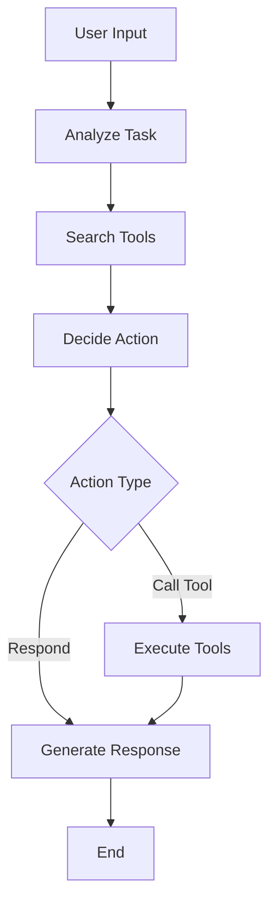

# UtcpAgent

A ready-to-use agent that provides intelligent UTCP tool calling capabilities. The agent automatically discovers, searches, and executes UTCP tools based on user queries.

## Quick Start

```python
import asyncio
import os
from langchain_openai import ChatOpenAI
from utcp_agent import UtcpAgent

async def main():
    # Set your OpenAI API key
    llm = ChatOpenAI(
        model="gpt-4o-mini",
        api_key=os.getenv("OPENAI_API_KEY")
    )
    
    # Create agent with book search capability
    agent = await UtcpAgent.create(
        llm=llm,
        utcp_config={
            "manual_call_templates": [{
                "name": "openlibrary",
                "call_template_type": "http",
                "http_method": "GET",
                "url": "https://openlibrary.org/static/openapi.json",
                "content_type": "application/json"
            }]
        }
    )
    
    # Chat with the agent
    response = await agent.chat("Can you search for books by George Orwell?")
    print(f"Agent: {response}")

asyncio.run(main())
```

## Installation

```bash
pip install utcp-agent langchain-openai
```

Set your API key:
```bash
export OPENAI_API_KEY=your_api_key_here
```

## Features

- **LangGraph Workflow**: Uses LangGraph for structured agent execution with proper state management
- **Intelligent Tool Discovery**: Automatically searches and selects relevant UTCP tools based on user queries
- **Multi-LLM Support**: Compatible with OpenAI, Anthropic, and other LangChain-supported language models
- **Streaming Support**: Optional streaming of workflow execution steps
- **Conversation Memory**: Built-in conversation history and checkpointing
- **Flexible Configuration**: Configurable through UTCP client config and agent config

## Advanced Configuration

### With Memory and Custom Prompts

```python
from utcp_agent import UtcpAgent, UtcpAgentConfig
from langgraph.checkpoint.memory import MemorySaver

agent_config = UtcpAgentConfig(
    max_tools_per_search=10,
    checkpointer=MemorySaver(),
    system_prompt="You are a helpful AI assistant with access to various tools through UTCP."
)

agent = await UtcpAgent.create(
    llm=llm,
    utcp_config=utcp_config,
    agent_config=agent_config
)

# Use thread_id for conversation continuity
response = await agent.chat("Find me a science fiction book", thread_id="user_1")
```

### With Environment Variables

```python
from pathlib import Path

utcp_config = {
    "load_variables_from": [{
        "variable_loader_type": "dotenv",
        "env_file_path": str(Path(__file__).parent / ".env")
    }],
    "manual_call_templates": [{
        "name": "openlibrary",
        "call_template_type": "http", 
        "http_method": "GET",
        "url": "https://openlibrary.org/static/openapi.json",
        "content_type": "application/json"
    }]
}
```

### Streaming Execution

```python
async for step in agent.stream("Search for AI books"):
    print(f"Step: {step}")
```

## Workflow

The agent follows a structured workflow using LangGraph:

1. **Analyze Task**: Understands the user's query and formulates the current task
2. **Search Tools**: Uses UTCP to find relevant tools for the task  
3. **Decide Action**: Determines whether to call tools or respond directly
4. **Execute Tools**: Calls the selected tool with appropriate arguments
5. **Respond**: Formats and returns the final response to the user



## Examples

See the `examples/` directory for comprehensive examples:

- **`basic_openai.py`**: Using GPT models with book search
- **`basic_anthropic.py`**: Using Claude models
- **`streaming_example.py`**: Real-time workflow monitoring
- **`config_file_example.py`**: Loading UTCP configuration from files
- **`memory_conversation.py`**: Multi-turn conversations with memory

## Configuration Options

### UtcpAgentConfig

- `max_iterations`: Maximum workflow iterations (default: 3)
- `max_tools_per_search`: Maximum tools to retrieve per search (default: 10)
- `system_prompt`: Custom system prompt for the agent
- `checkpointer`: LangGraph checkpointer for conversation memory
- `callbacks`: LangChain callbacks for observability
- `summarize_threshold`: Token count threshold for context summarization (default: 80000)

### UTCP Configuration

The agent accepts standard UTCP client configuration:
- Variable definitions and loading
- Manual call templates
- Tool provider configurations

## API Reference

### UtcpAgent

#### Class Methods

- `create(llm, utcp_config=None, agent_config=None, root_dir=None)`
  - Create agent with automatic UTCP client initialization

#### Instance Methods

- `chat(user_input: str, thread_id: Optional[str] = None) -> str`
  - Process user input and return agent response
  - Use thread_id for conversation continuity

- `stream(user_input: str, thread_id: Optional[str] = None)`
  - Stream workflow execution steps

## Error Handling

The agent includes comprehensive error handling:
- Tool execution failures are gracefully handled
- JSON parsing errors in LLM responses are managed
- UTCP client errors are caught and reported
- Fallback responses ensure the agent always responds

## Logging

Enable logging to monitor agent behavior:

```python
import logging
logging.basicConfig(level=logging.INFO)
# Disable UTCP library logging for cleaner output
logging.getLogger("utcp").setLevel(logging.WARNING)
```

## Contributing

1. Follow the existing code style and patterns
2. Add tests for new functionality
3. Update documentation for API changes
4. Ensure compatibility with UTCP core library

## License

See LICENSE file for details.
